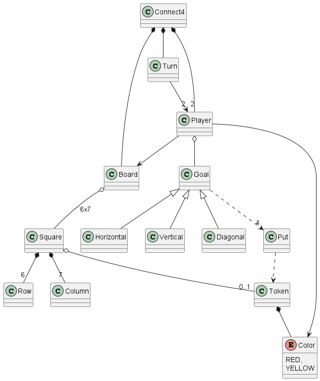
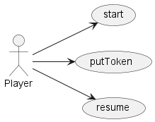
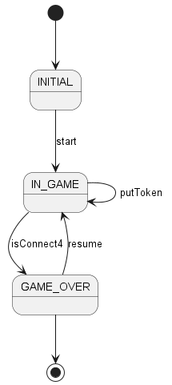
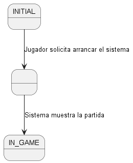
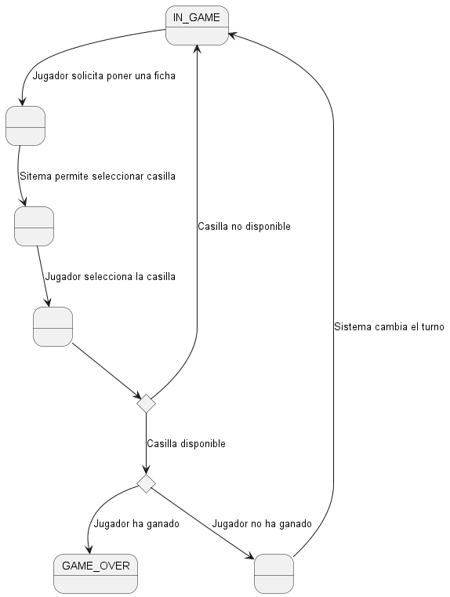
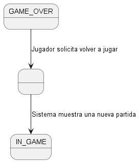

# Connect 4

## Requisitos

[Wikipedia](https://es.wikipedia.org/wiki/Conecta_4) -
[YouTube](https://www.youtube.com/watch?v=JBSbiilzg9U&ab_channel=NeonPandaTV)

### Modelo del Dominio

### Casos de uso

### Diagrama de contexto

### Especificación de los casos de uso

#### Start

#### PutToken

#### Resume

### Demo

[https://connect4-1234.netlify.app/](https://connect4-1234.netlify.app/)

